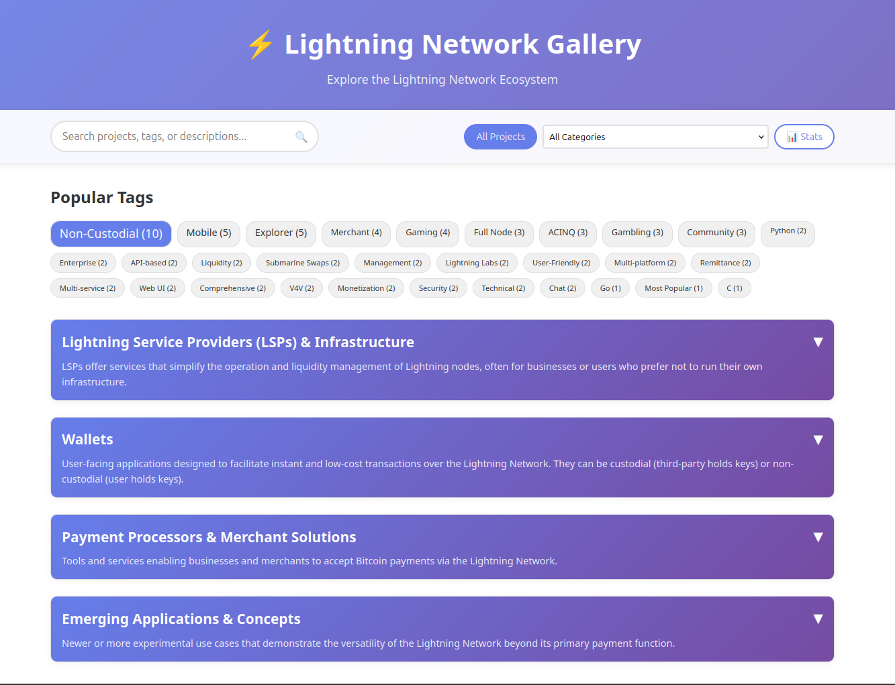

# ⚡ Lightning Network Gallery

An interactive, community-maintained visualization of the Lightning Network ecosystem. Explore implementations, wallets, tools, and resources powering the future of Bitcoin payments.



## 🌟 Features

- **Interactive Exploration**: Browse projects by category with expandable sections
- **Smart Search**: Find projects by name, tags, or descriptions
- **Tag-based Filtering**: Discover projects with specific technologies or features  
- **Statistics Dashboard**: View ecosystem metrics and category breakdowns
- **Mobile Responsive**: Works seamlessly on all devices
- **Community Driven**: Easy contribution process via GitHub pull requests

## 🚀 Quick Start

### View the Gallery
Visit the live site: [Lightning Network Gallery](https://bitdevsnbo.github.io/lngal)

### Add a Project
1. Navigate to [`lngal_data.json`](lngal_data.json)
2. Click the pencil icon to edit
3. Add your project following our [Contributing Guide](docs/CONTRIBUTING.md)
4. Submit a pull request

## 📊 Current Statistics

The gallery currently includes:
- **200+** Lightning Network projects
- **12** main categories
- **50+** different tags
- Projects from wallets to infrastructure tools

## 🏗️ Architecture

This is a static web application built with:
- **HTML5** - Semantic structure
- **CSS3** - Modern responsive design
- **Vanilla JavaScript** - No frameworks, fast loading
- **GitHub Pages** - Free hosting with automatic deployment
- **GitHub Actions** - Automated validation and deployment

### Project Structure
```
lngal/
├── index.html              # Main application
├── styles.css         # All styling
├── js/
│   ├── app.js            # Core application logic
│   └── components.js     # UI component functions
├── lngal_data.json       # Project data
├── docs/                 # Documentation
└── .github/workflows/    # CI/CD automation
```

## 🤝 Contributing

We welcome contributions! Here's how you can help:

### Adding Projects
See our [Contributing Guide](docs/CONTRIBUTING.md) for detailed instructions.

### Quick Contribution
1. Fork this repository
2. Edit `lngal_data.json` to add your project
3. Test locally by opening `index.html`
4. Submit a pull request

### Data Format
Projects follow this structure:
```json
{
  "project_name": "Your Project",
  "project_level": "Brief description",
  "links": [
    {
      "type": "Website",
      "url": "https://example.com",
      "citation": ""
    }
  ],
  "tags": ["tag1", "tag2"]
}
```

## 📚 Documentation

- [Contributing Guide](docs/CONTRIBUTING.md) - How to add/update projects
- [Data Schema](docs/DATA_SCHEMA.md) - Technical data format specification
- [Project Plan](plan.md) - Complete architecture and implementation plan

## 🔄 Automatic Deployment

Changes to the main branch automatically:
1. Validate JSON syntax and structure
2. Run quality checks
3. Deploy to GitHub Pages
4. Update the live site within minutes

## 🛠️ Local Development

### Prerequisites
- Any modern web browser
- Basic text editor (VS Code recommended)

### Setup
```bash
git clone https://github.com/bitdevsnbo/lngal
cd lngal
# Simply open index.html in your browser
```

### Testing Changes
1. Edit `lngal_data.json`
2. Open `index.html` in browser
3. Verify changes appear correctly
4. Test search and filtering

### JSON Validation
```bash
# Validate syntax
python -m json.tool lngal_data.json

# Or use online tools like JSONLint
```

## 🔒 Security

- Content Security Policy headers
- No external dependencies
- Input sanitization for all user data
- HTTPS-only links encouraged

## 📈 Metrics

Track project success through:
- GitHub stars and forks
- Pull request frequency
- Site traffic (if analytics added)
- Community engagement

## 🗺️ Roadmap

### Near Term
- [ ] Enhanced search with highlighting
- [ ] Project comparison feature
- [ ] Export functionality (CSV, JSON)
- [ ] Dark mode toggle

### Future Enhancements
- [ ] Historical project data tracking
- [ ] Integration with GitHub APIs for live stats
- [ ] Community voting on project quality
- [ ] Mobile app version

## 🤔 FAQ

**Q: How do I suggest a new category?**
A: Open an issue on GitHub with your suggestion and reasoning.

**Q: What qualifies as a Lightning Network project?**
A: Any software, service, or resource that directly uses or supports the Lightning Network.

**Q: Can I update information for existing projects?**
A: Yes! Follow the same contribution process to update any project data.

**Q: Is this affiliated with any Lightning Network implementation?**
A: No, this is an independent community resource covering the entire ecosystem.

## 📄 License

This project is open source under the [MIT License](LICENSE).

## 🙏 Acknowledgments

- Lightning Network community for building amazing projects
- Contributors who help maintain this resource
- GitHub for providing free hosting and automation

## 📞 Contact

- Issues: [GitHub Issues](https://github.com/bitdevsnbo/lngal/issues)
- Discussions: [GitHub Discussions](https://github.com/bitdevsnbo/lngal/discussions)
- Discord: [bitdevsnbo](https://discord.gg/RQmYSGJeNZ)

---

**Made with ⚡ by the BitDevs Nairobi community**
